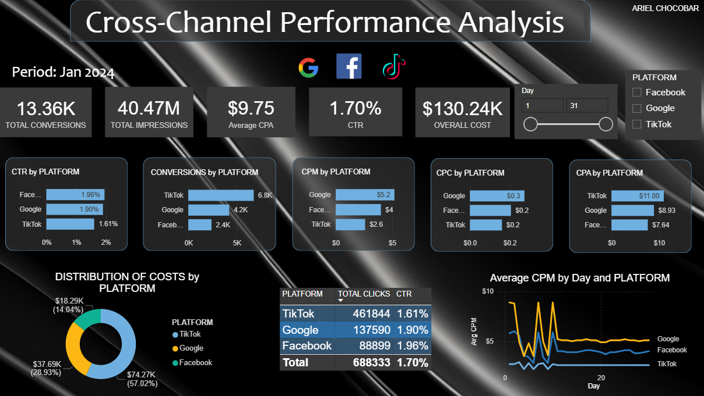

# PARA_IMPROVADO

# Cross-Platform Marketing Performance Analysis

## 📊 Project Overview
This project demonstrates the development of an end-to-end data pipeline, transforming raw, fragmented marketing data into actionable business intelligence. By leveraging **Snowflake** for cloud data warehousing and **Power BI** for visualization, the project provides a unified view of marketing performance across multiple platforms.

## 🛠️ Tech Stack
* **Data Warehousing:** Snowflake
* **Business Intelligence:** Power BI
* **Data Processing:** SQL (Snowflake Dialect)
* **Presentation:** Gamma App
* **Source Data:** CSV (Multi-source marketing exports)

## ⚙️ Implementation Roadmap

### Phase 1: Data Ingestion & Storage
* **Environment Setup:** Configured databases, schemas, and warehouses within **Snowflake**.
* **Data Loading:** Uploaded three primary CSV datasets to Snowflake internal stages.
* **Automation:** Executed `COPY INTO` commands to transition data from stages to structured relational tables.

### Phase 2: Data Transformation (ELT)
* **Unification:** Developed SQL scripts to merge three disparate datasets into a single, comprehensive "Master Marketing Table."
* **Feature Engineering:** Calculated critical business metrics (CPA, ROAS, and Conversion Rates) directly within Snowflake to ensure high-performance data modeling.
* **Data Cleaning:** Handled null values and standardized date formats to ensure cross-platform consistency.

### Phase 3: Visualization & Insight Delivery
* **Live Connection:** Connected Power BI to Snowflake for seamless data accessibility.
* **Dashboard Design:** Built an interactive dashboard featuring platform-specific deep dives, budget pacing, and ROI heatmaps.

---

## 🚀 Key Insights
The final analysis provides a strategic look at resource allocation and channel efficiency. You can access the results in two ways:

* **Interactive Storytelling:** [View the Live Analysis on Gamma](https://gamma.app/docs/Cross-Platform-Marketing-Performance-Analysis-k00fwrlfsd0xkoo)
* **Offline Access:** A **PDF version** of the full analysis is available in the `reports/` folder of this repository.

